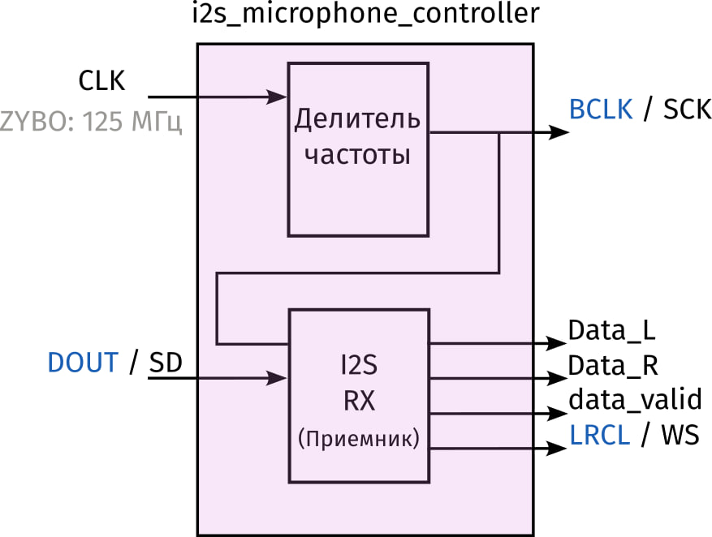
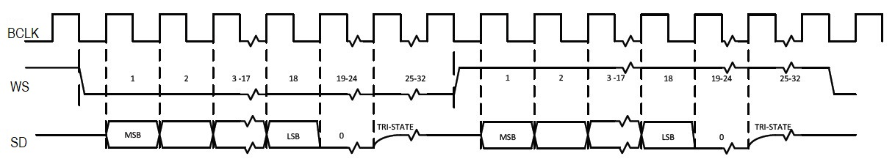
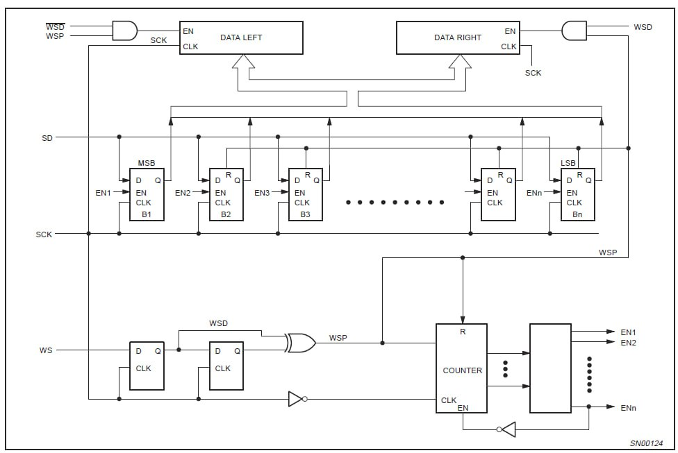

# Контроллер I2S микрофона SPH0645LM4H
Разрабатываемый контроллер имеет следующую функциональную схему.



## Исходные данные
 - Входная тактовая частота устройства 125 МГц (плата ZYBO)
 - Частота дискретизации сигнала 32 кГц
 - Устройство должно поддерживать прием стерео-сигнала (левый и правый канал), хотя фактически пока будет использоваться только левый канал, поскольку есть только один микрофон.
 - Формат данных (I2S) 24 бита, данные передаются в дополнительном коде. Точность данных: 18 бит. Неиспользуемые биты заполняются нулями.

## Принцип работы устройства
### Определение частоты дискретизации
На вход ```CLK``` контроллера подается тактовый сигнал с частотой 125 МГц. Данный тактовый сигнал поступает на вход делителя частоты, который используется для формирования тактового сигнала ```BCLK``` интерфейса I2S. 



Частота сигнал ```BCLK``` определяет частоту дискретизации сигнала, поскольку за 64 такта этого сигнала происходит передача одного отсчета левого канала и правого канала. Таким образом частота дискретизации равна

$$ f_s = \mathrm{BCLK}/64.$$

Таким образом, если контроллер должен обеспечить частоту дискретизации 32 кГц, то на выходе ```BCLK``` нужно сформировать частоту

$$ \mathrm{BCLK} = f_s \times 64 = 32 \times 10^3 \times 64 = 2048 \times 10^3 = 2.048 \;\mathrm{MHz}.$$

### Приемник I2S
Приемник I2S контроллера микрофона должен работать в режиме master, т.е. он должен отвечать за формирование сигнала ```WS```. Согласно спецификации нужно обеспечить переключение сигнала ```WS``` синхронно со спадом сигнала ```BCLK``` (как показано на временной диаграмме).

Для правильной работы приемника I2S рекомендуется реализовать его по схеме, приеденной в спецификации на интерфейс I2S.



Дополнительной задачей является формирование сигнала ```data_valid_L``` - который сигнализирует о том, что буферный регистр (DATA LEFT) хранит валидное значение.